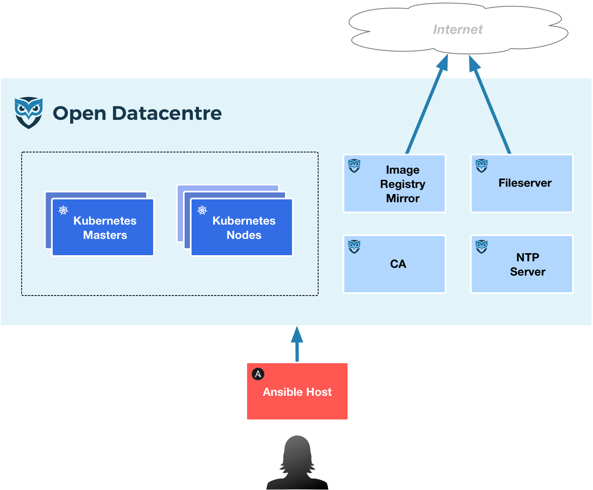

# Topology
___

The **opendc** topology is comprised of both a base topology for the platform components and a topology for each of the [*Solutions*](../reference/solution.md).
___

## Base Topology

The components that make up the **opendc** base topology are shown in the following diagram and described in the table beneath.

| Name                  | Description             |
|:----------------------|:------------------------|
| Ansible Host          | The *Ansible Host* is used to install, manage and update the **opendc** base components. |
| Kubernetes Masters    | The *Kubernetes Masters* manage the Kubernetes cluster. |
| Kubernetes Nodes      | The *Kubernetes Nodes* run the workloads. |
| Fileserver            | The *Fileserver* is used to download the installation media for the **opendc** base components. |
| Image Registry Mirror | The *Image Registry Mirror* is used to cache pulled Docker images.  This greatly improves performance for *Kubernetes Nodes* when using previously pulled images. |
| CA                    | The *CA* (Certificate Authority) is used to generate the private keys and certificates for the *opendc* base components and the **opendc** [*Solutions*](../reference/solution.md). |
| NTP Server            | The *NTP Server* is used by the **opendc** nodes to synchronise the time and date.  Vital in a distributed system . |
___

## Solution Topology

Each [*Solution*](../reference/solution.md) for a [*Capability*](../reference/capability.md) has its own topology.  Details of which can be found on the specific *Solutions* documentation page, i.e. [Distributed Block Storage (Ceph)](../reference/solutions/distributed_block_storage_ceph.md#topology).

